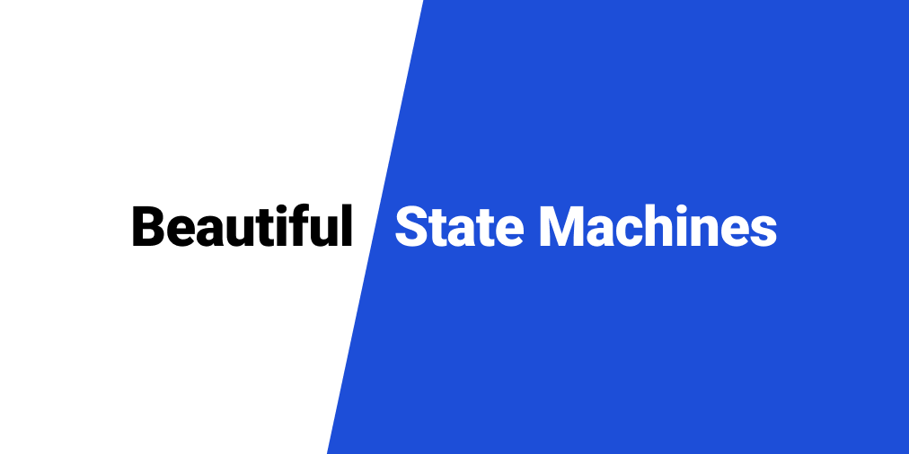

<!-- ALL-CONTRIBUTORS-BADGE:START - Do not remove or modify this section -->

<!-- ALL-CONTRIBUTORS-BADGE:END -->

# XState Catalogue

XState Catalogue is a collection of professionally designed state machines you can drop into your XState projects.

**We're accepting contributions!** We'd love to hear your ideas for new machines and ways to improve the catalogue.

Check out the [full site](https://xstate-catalogue.com) for the full browsing experience.

### Setting up the repo

1. Run `yarn install`
2. Run `yarn dev` to run it on localhost:3000

### Contributing a new machine

1. Run `yarn generate` to generate the boilerplate for a new machine.
2. Follow the instructions in the CLI.
3. Just like that, you can start editing the files and write a new machine.

## Contributors ✨

Thanks goes to these wonderful people ([emoji key](https://allcontributors.org/docs/en/emoji-key)):

<!-- ALL-CONTRIBUTORS-LIST:START - Do not remove or modify this section -->
<!-- prettier-ignore-start -->
<!-- markdownlint-disable -->
<table>
  <tr>
    <td align="center"><a href="http://chanchan.io"> <b>Mark Chandler</b></a> <a href="https://github.com/mattpocock/xstate-catalogue/commits?author=with-heart" title="Code">💻</a></td>
    <td align="center"><a href="https://github.com/mattpocock"> <b>Matt Pocock</b></a> <a href="https://github.com/mattpocock/xstate-catalogue/commits?author=mattpocock" title="Code">💻</a> <a href="#ideas-mattpocock" title="Ideas, Planning, & Feedback">🤔</a> <a href="#example-mattpocock" title="Examples">💡</a> <a href="#design-mattpocock" title="Design">🎨</a></td>
    <td align="center"><a href="https://twitter.com/belinburgh"> <b>Henri Maurer</b></a> <a href="https://github.com/mattpocock/xstate-catalogue/commits?author=hmaurer" title="Code">💻</a> <a href="#ideas-hmaurer" title="Ideas, Planning, & Feedback">🤔</a></td>
    <td align="center"><a href="https://twitter.com/bemayr"> <b>Bernhard Mayr</b></a> <a href="https://github.com/mattpocock/xstate-catalogue/commits?author=bemayr" title="Code">💻</a> <a href="#ideas-bemayr" title="Ideas, Planning, & Feedback">🤔</a></td>
    <td align="center"><a href="https://damiensedgwick.com"> <b>Damien Sedgwick</b></a> <a href="https://github.com/mattpocock/xstate-catalogue/commits?author=damiensedgwick" title="Code">💻</a></td>
    <td align="center"><a href="https://rubenmoya.dev"> <b>Rubén Moya</b></a> <a href="https://github.com/mattpocock/xstate-catalogue/commits?author=rubenmoya" title="Code">💻</a></td>
    <td align="center"><a href="https://github.com/mr-bjerre"> <b>Nicolai Bjerre Pedersen</b></a> <a href="https://github.com/mattpocock/xstate-catalogue/commits?author=mr-bjerre" title="Code">💻</a></td>
  </tr>
  <tr>
    <td align="center"><a href="http://timdeschryver.dev"> <b>Tim Deschryver</b></a> <a href="https://github.com/mattpocock/xstate-catalogue/commits?author=timdeschryver" title="Code">💻</a></td>
  </tr>
</table>

<!-- markdownlint-restore -->
<!-- prettier-ignore-end -->

<!-- ALL-CONTRIBUTORS-LIST:END -->

This project follows the [all-contributors](https://github.com/all-contributors/all-contributors) specification. Contributions of any kind welcome!
